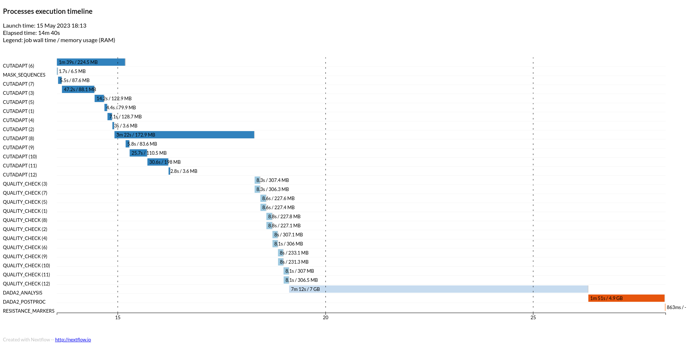

# Running the Pipeline

Nextflow is a command line tool can run on macOS and linux-based systems. At a minimum, users will want to specify where their data is stored and provide a minimum set of parameters to run core pipeline modules. 

## A basic example

Below is an example of how to run the pipeline setting only the most necessary parameters on an HPC.

```bash
nextflow run main.nf --readDIR /wynton/scratch/data/AAD1017 --refseq /wynton/share/reference.fasta --target v4 -profile sge,apptainer -config conf/custom.config
```

Notice how there some parameters have two hypens in front of their name (ie. `--readDIR`) and some only have one (ie. `-config`). The difference is because some parameters are *pipeline-specific* while others are defined by nextflow. Two hyphens ('--') indcate that the parameter is defined within the pipeline, and a single hypen (`-`) indicates that the parameter is nextflow defined. 

The table below defines the each parameter above:

|Parameter|Description|
|:--:|:--:|
|readDIR|This is where you will define the location of your sequencing data. It should be a folder that contains your forward (R1) and reverse (R2) fastq files.|
|refseq|The refseq fasta file is used during postprocessing to map alleles to their appropriate loci. In addition, indels and snps are identified at this point.|
|target|This is how to specify which amplicon table the pipeline should use. The amplicon tables are located under the `resources` folder of the repository|
|profile|Specifies which runtime profile to use. See the [getting started] panel to learn more about profiles|
|config|Config files are useful for setting resources for each module. More information about pipeline resources can be found below.|

## Pipeline resources

Each module should be assigned a specific amount of RAM, processors and execution time. There is no one size fits all per se, but a good strategy to begin is requesting more resources than you think you will need, and then reduce as needed.


### Understanding Resource Requirements

Below is a schematic that shows how many resources each process uses with a 12 sample toy dataset (676 MB total) and is meant to give a sense of which processes are more computationally intensive. 

{: .info }
This is a *much smaller* dataset then you will usually use. Depending on the sequencer used and the library preparation, datasets can range in size (5 GB to 100+ GB).



Some processes are more expensive computationally and will always require more resources. `DADA2_ANALYSIS` requires by far the most memory and time to run. `DADA2_POSTPROC` does not require much time to run, but does require a fair number of resources 4.6GB or RAM.

The least costly processes are the `CUTADAPT` and `QUALITY_CHECK` processes, which are assigned one sample each out of the 12 samples in the dataset. Most of these processes use between 200-300MB of RAM and run for a few seconds. Some samples have more reads - the largest sample, `GM-1A-D2-10000-P2-3_S20_L001` has 1690087 forward reads, which is over 2.3 times more than the second sample, and likely requires more processing time (see `CUTADAPT(8)`).

### How to set resources

Below is an example `custom.config` file found under the `conf/` directory that specifies resources for each module. The easiest thing to do when assigning your own resources is to open this file and adjust resources accordingly. 

{: .info }
The file below has recommended settings for a dataset that is between 5 - 10 GB. When adjusting these numbers, a good strategy is to double or halve the of resources, depending if you are trying to increase or decrease resource allocation, respectively. 

```
/*
~~~~~~~~~~~~~~~~~~~~~~~~~~~~~~~~~~~~~~~~~~~~~~~~~~~~~~~~~~~~~~~~~~~~~~~~~~~~~~~~~~~~~~~~
     aarandad / ampseq_workflow Nextflow config file
~~~~~~~~~~~~~~~~~~~~~~~~~~~~~~~~~~~~~~~~~~~~~~~~~~~~~~~~~~~~~~~~~~~~~~~~~~~~~~~~~~~~~~~~
          Custom config options for institutions
----------------------------------------------------------------------------------------
*/

// NOTE: current configuration target Wynton at UCSF. You may change or erase this file as needed.

process {

    // process resources
    withName: 'CUTADAPT|QUALITY_CHECK' {
      time = '60m'
      cpus = 4
      penv = 'smp'
      memory = '8 GB'
    }
    withName: 'DADA2_ANALYSIS' {
      time = '600m'
      cpus = 4
      penv = 'smp'
      memory = '32 GB'
    }
    withName: 'DADA2_POSTPROC' {
      time = '120m'
      cpus = 1
      penv = 'smp'
      memory = '64 GB'
    }
    withName: 'RESISTANCE_MARKERS' {
      time = '120m'
      cpus = 4
      penv = 'smp'
      memory = '8 GB'
    }
}

executor {
  $sge {
      queueSize = 1000
      // pollInterval = '30sec'
  }
}
```

Below is a table that describes each resource:

|Resource|Description|
|:--:|:--:|
|time|The amount of time the process should use. After surpassing this time, the job will timeout.|
|cpus|The number of cores to use. A core is a processing unit that executes commands in code. Cores are crucial for parallel processing.|
|penv|The parallel environment to use. You will generally never need to change this value.|
|memory|The amount of memory to use for the process|

The resources consumed by a process will depend on the process itself as well as the size of the dataset you wish to run. 

### Threading

If an application is multithreaded, raising the number cores *should* decrease the amount of time a process takes. Increasing the number of cores can also increase the amount of memory used by the application, so settings may also need be tinkered with depending on the limitation of your hardware. Currently, `DADA2_ANALYSIS` and `DADA2_POSTPROC` are the only modules that are multithreaded.  


## Other workflows

Below are workflows that are useful for running specific modules of the pipeline. 

### QC Only

If you only want to run the QC module, you can use the following command:

```bash
nextflow run main.nf --readDIR /wynton/scratch/data/AAD1017 --target v4 -profile sge,apptainer -config conf/custom.config --QC_only
```

If you specify the `--QC_only` flag, this will just run the QC module. This may be useful if you want to understand your coverage before running the entire pipeline.

If you run this workflow, the only outputs you will see is your `amplicon_coverage.txt`, `sample_coverage.txt` and the quality report under `quality_report/QCplots.html`. 

### Postprocessing only

If you provide the `dada2.clusters.txt` file from a previous run using the `--denoised_asvs` flag, this will just run the postprocessing module. There is no need to supply a `readDIR` to run this workflow. You may want to run this workflow if you want to rerun the postprocessing module with different parameters. For example, you may want to run the postprocessing module with different allele masking parameters, or supply a different alignment threshold.

Below is an example of how to run just the postprocessing module:

```bash
nextflow run main.nf --denoised_asvs /wynton/scratch/results/raw_dada2_output/dada2.clusters.txt --target v4 -profile sge,apptainer
```

The output of this workflow is the `allele_data.txt` file. 

