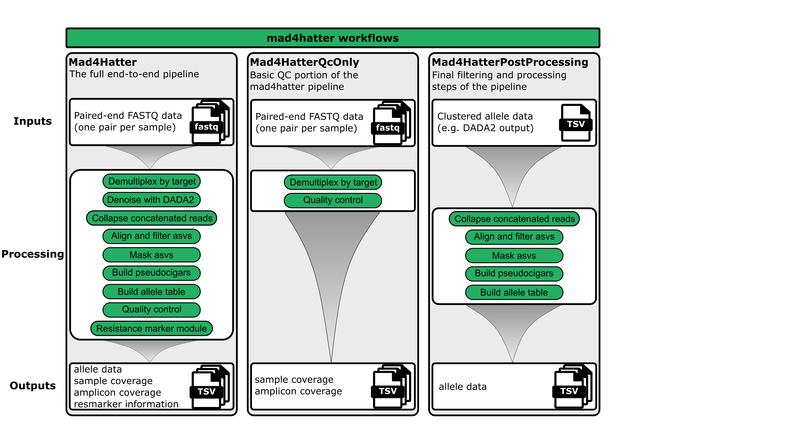

# Running the Pipeline

This page explains how to run the MAD4HATTER pipeline, including which parameters are required, what workflows are available, and how to customize your run.

## Understanding Parameters

Parameters with **two hyphens** (`--`) are pipeline-specific parameters defined by MAD4HATTER. Parameters with **one hyphen** (`-`) are Nextflow-defined parameters. For example, `--readDIR` is a pipeline parameter (two hyphens) and `-profile` is a Nextflow parameter (one hyphen).

## Available Workflows

The MAD4HATTER pipeline offers three different workflows. Most users will run only the `complete` (default) workflow, however, in some cases you may choose one of the other two workflows. 

### **1. Complete Workflow (Default) :**
**The primary and most commonly used workflow**

**What it does:** Runs the full end-to-end workflow, from raw FASTQs through microhaplotype calling and drug-resistance profiling.

**When to use:** This is the standard workflow for processing your sequencing data end-to-end.

### 2. QC Only Workflow

**What it does:** Only the steps required to generate basic QC metrics.

**When to use:** Use this if you want to quickly check your data quality and coverage before running the full pipeline.

### 3. Postprocessing Only Workflow

**What it does:** Re-runs post-processing (alignment, filtering, masking, allele calling) on previously denoised data.

**When to use:** Use this if you want to re-analyze your DADA2 output with different parameters (e.g., different masking settings or alignment thresholds).


---

## Required Parameters

The parameters you need depend on which workflow you're running. To control which workflow you are running use `--workflow_name`. By default this is set to `complete`, so is only necessary when running `qc` or `postprocessing`

### For Complete and QC Workflows

These parameters are **required**:

| Parameter | Description | Example |
|:---------:|:------------|:--------|
| `--readDIR` | Path to directory containing your FASTQ files (R1 and R2) | `/path/to/data` |
| `--pools` | Comma-separated list of amplicon pools to analyze | `D1,R1,R2` | 

### For Postprocessing Workflow

These parameters are **required**:

| Parameter | Description | Example |
|:---------:|:------------|:--------|
| `--denoised_asvs` | Path to `dada2.clusters.txt` from a previous run | `/path/to/dada2.clusters.txt` |
| `--pools` | Comma-separated list of amplicon pools | `D1,R1,R2` |

### Runtime Profile (Required for all workflows)

You must specify a runtime profile using `-profile`:

- `docker` - For local computers
- `apptainer` or `conda` - For HPC clusters
- See [Quick Start](quick-start.md) for details on choosing a profile

---

## Pre-Configured Pools

The pipeline includes several pre-configured pools that are ready to use. These pools can be used individually or combined depending on your data.

| Pool Name | Description | Shorthand Name | Legacy pool name |
|:---------:|:------------|:---------------|:-----------------|
| **MAD4HatTeR Pools** |
| **D1.1** | A primer pool targeting 165 high diversity targets and 5 loci targetting the ldh gene in P. falciparum and in 4 non-falciparum Plasmodium species (P. vivax, P. malariae, P. ovale, and P. knowlesi) |  D1 | 1A |
| **R1.1** | 82 targets informing drug and diagnostic resistance, Plasmodium species identification, immune-related targets | - | 1B |
| **R1.2** | R1.2 is a reduced version of primer pool R1.1, containing 47 targets, designed to reduce primer dimers and increase sensitivity | R1 | 5 |
| **R2.1** | 31 targets to provide information on drug and diagnostic resistance, Plasmodium species identification, immune-related targets. This complements R1, covering missing codons | R2 | 2 |
| **PfPHAST Pools** |
| **M1.1** | 41 targets for drug and diagnostic resistance, Plasmodium spp. identification, csp, and 10 diversity targets. "Minimal" set for prioritary markers and TES classification | M1 | - |
| **M2.1** | 15 targets for drug and diagnostic resistance, Plasmodium spp. identification, csp, and 10 diversity targets. "Minimal" set for prioritary markers and TES classification. Complements M1.1 for missing codons | M2 | - |
| **M1.addon** | 4 targets for P. vivax, P. malariae, P. ovale and P. knowlesii mitochondrial cytb targets for increased sensitivity in non-Pf detection (recommended to add to M1.1) | - | - |
| **Other Pools/ Panels** |
| **4cast** | A single-target panel for analyzing diversity in the apical membrane antigen 1 (AMA1) gene, which is important for invasion of red blood cells by Plasmodium parasites. This panel is useful for studying AMA1 genetic diversity and population structure. For more information, see Miller et al. (2017). | - | - |
| **ama1** | 4CAST is a small multiplex of four highly polymorphic antigenic loci: CSP, AMA1, SERA2 and TRAP. For more information, see LaVerriere et al. (2021). | - | - |
| **v1** | Version 1 of the MADHatTeR panel | - | - |
| **v2** | Version 2 of the MADHatTeR panel | - | - |

### Using Pre-Configured Pools

To use one or more pre-configured pools, simply specify them in the `--pools` parameter:

```bash
# Use a single pool
--pools D1.1

# Combine multiple pools
--pools D1.1,R1.2,R2.1

# Use shorthand names
--pools D1,R1,R2
```

The pipeline will automatically locate the configuration files for these pools. No additional setup is required.

!!! note "Common Combos"
    The most common combination currently being used for MAD4HatTeR is D1.1, R1.2, and R2.1. This can be processed using `--pools D1,R1,R2`.

!!! tip "Combining Pools"
    You can combine any of the pre-configured pools by listing them as a comma-separated list. The pipeline will process all targets from the specified pools together.

!!! note "Custom Pools"
    If you need to create your own custom pools or panels, see the [Custom Pools](custom-pools.md) page for detailed instructions.

---

## Optional Parameters

These parameters can be customized but have defaults:

| Parameter | Description | Default | When Needed |
|:---------:|:------------|:--------|:------------|
| `--outDIR` | Output directory for results | `results` | To specify custom output location |
| `--workflow_name` | Which workflow to run | `complete` | To run `qc` or `postprocessing` workflows |
| `--refseq_fasta` | Path to targeted reference sequence | Auto-generated from pools | To use a custom reference |
| `--genome` | Path to full genome file covering all targets | Not used | To generate reference from genome |
| `--amplicon_info` | Path to custom amplicon info file | Auto-generated from pools | To use custom amplicon definitions |

!!! note "Reference Sequences"
    You can provide either `--refseq_fasta` (targeted reference) or `--genome` (full genome). If neither is provided, the pipeline will automatically build a reference from the pool configurations. If both are provided, `--refseq_fasta` takes priority.

---

## Workflow Examples

### Complete Workflow (Default)

This is the most common workflow - it processes your data from start to finish.

```bash
nextflow run main.nf \
  --readDIR /path/to/your/data \
  --outDIR /path/to/results \
  --pools D1,R1,R2 \
  -profile docker
```

**What happens:**

1. Reads are demultiplexed and adapters removed
2. Sequences are inferred using DADA2
3. Sequences are aligned, filtered, masked, and converted to allele tables including microhaplotypes and pseudo_cigars.
4. Quality control metrics are calculated
5. Resistance markers are extracted 

**Outputs:** All pipeline outputs including `allele_data.txt`, coverage files, and quality reports. For more information, see [Pipeline Outputs](pipeline-outputs.md).

---

### QC Only Workflow

Use this to quickly assess your data quality before running the full pipeline.

```bash
nextflow run main.nf \
  --readDIR /path/to/your/data \
  --outDIR /path/to/results \
  --pools D1,R1,R2 \
  --workflow_name qc \
  -profile docker
```

**What happens:**

1. Reads are demultiplexed and adapters removed
2. Quality control metrics are calculated

**Outputs:**
- `amplicon_coverage.txt` - Coverage per amplicon
- `sample_coverage.txt` - Coverage per sample

!!! tip "Quick Quality Check"
    This workflow is much faster than the complete workflow and helps you verify your data is suitable before running the full analysis, but is not required. 

---

### Postprocessing Only Workflow

Use this to re-analyze DADA2 output with different parameters.

```bash
nextflow run main.nf \
  --denoised_asvs /path/to/previous/run/dada2.clusters.txt \
  --outDIR /path/to/new/results \
  --pools D1,R1,R2 \
  --workflow_name postprocessing \
  -profile docker
```

**What happens:**

1. Takes DADA2 output from a previous run as input
2. Re-runs alignment, filtering, masking, and allele calling
3. Generates new allele tables

**Outputs:**
- `allele_data.txt` - Final allele table with updated parameters

!!! note "No Raw Data Needed"
    This workflow doesn't require `--readDIR` since it uses pre-processed DADA2 output (`--denoised_asvs`).

---

## Parameter Reference Quick Guide

### Minimum Command (Complete Workflow)

```bash
nextflow run main.nf \
  --readDIR /path/to/data \
  --pools D1,R1,R2 \
  -profile docker
```

### With Custom Output Directory

```bash
nextflow run main.nf \
  --readDIR /path/to/data \
  --outDIR /custom/output/path \
  --pools D1,R1,R2 \
  -profile docker
```

### With Custom Targeted Reference

```bash
nextflow run main.nf \
  --readDIR /path/to/data \
  --pools D1,R1,R2 \
  --refseq_fasta /path/to/reference.fasta \
  -profile docker
```

### With Whole Genome Reference

```bash
nextflow run main.nf \
  --readDIR /path/to/data \
  --pools D1,R1,R2 \
  --genome /path/to/whole_genome_reference.fasta \
  -profile docker
```


---

## Getting Help

To see all available parameters and their descriptions:

```bash
nextflow run main.nf --help
```

This displays the complete help message with all pipeline parameters.

---

## Next Steps

- **Review outputs**: See [Pipeline Outputs](pipeline-outputs.md) for details on what files are generated
- **Customize parameters**: See [Advanced Pipeline Parameters](parameters.md) for all parameter options
- **Configure resources**: See [Pipeline Resources](resources.md) for computational resource settings
- **Use custom pools**: See [Custom Pools](custom-pools.md) for setting up bespoke amplicon panels
- **Understand modules**: See [Core Pipeline Modules](modules/core-pipeline/index.md) for details on each processing step
