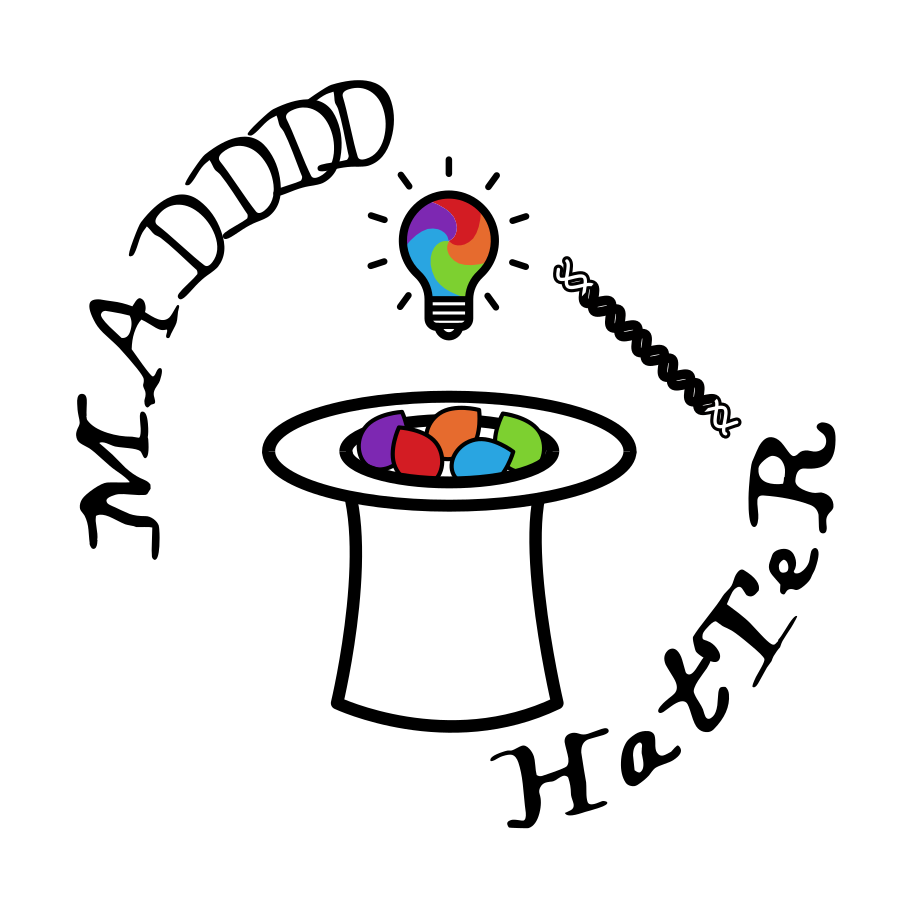

  

    <h1>The MAD4HATTER Amplicon Sequencing Pipeline</h1>
    
<strong>M</strong>ultiplex <strong>A</strong>mplicons for <strong>D</strong>rugs, <strong>D</strong>iagnostics, <strong>D</strong>iversity, and <strong>D</strong>ifferentiation using <strong>H</strong>igh <strong>T</strong>hroughput <strong>T</strong>argeted <strong>R</strong>esequencing

  

  

    
  

Welcome to the MAD4HATTER pipeline!

Mad4hatter is a bioinformatics pipeline designed to analyse Plasmodium Illumina Amplicon sequencing data. It processes raw FASTQ files and produces an allele table, core QC metrics, and drug-resistance information. It was originally developed for the MAD4HatTeR panel but has since been adapted to support additional panels. While the pipeline can be run on any panel, it was optimised using MAD4HatTeR data; panels with substantially different properties, such as very short amplicon targets, may require additional tuning to achieve optimal performance. Several commonly used panels are preconfigured for convenience, and new panels can be easily added through simple configuration.

The pipeline can be run using **Nextflow** (command-line interface) or **Terra** (cloud-based platform with a graphical interface).

**Choose Your Platform**

  <a href="getting-started/" class="platform-button">
    
    Run with Nextflow
    Command-line interface for local computers and HPC clusters
  </a>
  
  <a href="https://app.terra.bio/#workspaces/gates-malaria/Mad4Hatter" target="_blank" rel="noopener" class="platform-button">
    
    Run on Terra
    Cloud-based platform with graphical interface - no installation required
  </a>

 

**Thank you to the contributors of the MAD4HATTER pipeline!**

<ul class="contributors-list" id="contributors-list">
  <li>Loading contributors...</li>
</ul>

