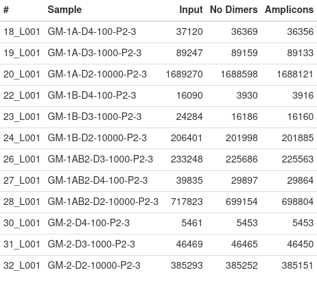
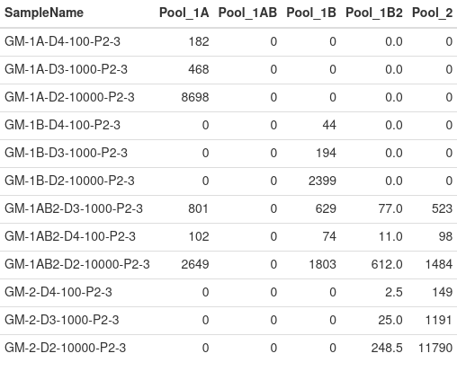
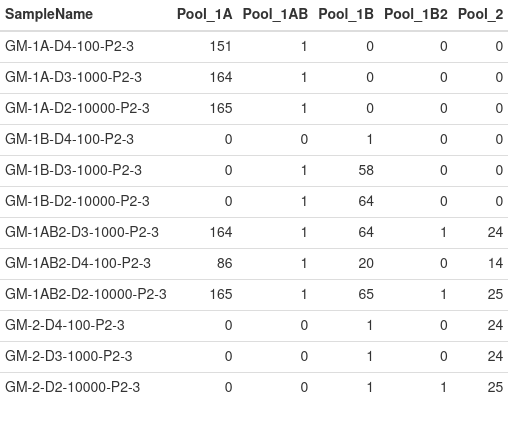

# Quality Control

This module will calculate sample and amplicon coverage from your demultiplexed reads, and will create a HTML report to be viewed in your browser. 

## Coverage metrics

The above table reports the number of total reads per sample (`Input`), the number of reads after adapter dimers are removed (`No Dimers`) and the number of reads that have the expected primers attached (`Amplicons`). Ideally, each sample should have nearly 100 reads per amplicon, so the expected number should be `2 * 100 * A`, where `A` is the number of amplicons that were included in the library preparation. If all pools are amplified, then you should hope to see *at least* 22000-27000 reads for each sample. 

The above table reports the median read count across amplicons per sample by pool. For sufficient coverage, it is recommended that the median read count per pool be greater than 100.

As mentioned, 100 reads or more for each amplicon is recommeneded. This table calculates the number of amplicons with 100 reads or more per sample by pool.

## File Outputs

### sample_coverage.txt / amplicon_coverage.txt
 
These provide the number of reads in your sequencing files at the sample and amplicon level, respectively. Additionally, the sample coverage file will provide read counts post quality filtering and removal of primer dimers.

[jekyll-organization]: https://github.com/EPPIcenter
