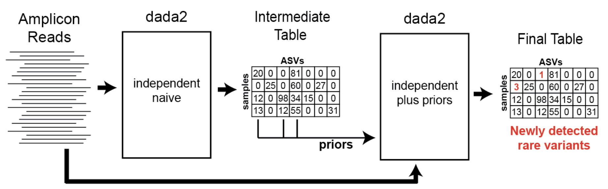

# Pipeline Parameters

This page describes all customizable parameters in the MAD4HATTER pipeline, organized by module.

## Cutadapt Parameters

Cutadapt handles adapter removal, primer trimming, and quality filtering. These parameters control the demultiplexing and quality control steps.

| Parameter | Description | Default | When to Adjust |
|:---------:|:------------|:--------|:---------------|
| `--cutadapt_minlen` | Minimum read length after trimming (shorter reads are discarded) | `100` | Increase if you have short amplicons; decrease to keep more reads |
| `--quality_score` | Quality score threshold for trimming | `20` | Lower (e.g., `15`) to keep more reads; higher (e.g., `25`) for stricter filtering |
| `--gtrim` | Enable NextSeq-specific quality trimming | `false` | Set to `true` if seeing issues with polyG tails (uses `--nextseq-trim` instead of `-q`) |
| `--allowed_errors` | Number of mismatches allowed in adapter/primer sequences | `0` | Increase (e.g., `1-2`) if primers have known mismatches |

### Quality Trimming Behavior

- **When `--gtrim false`** (default): Uses standard quality trimming with `-q` flag
- **When `--gtrim true`**: Uses NextSeq-specific trimming with `--nextseq-trim` flag

Both use the `--quality_score` value as the threshold.

!!! warning "Quality Trimming Behavior"
     `--nextseq-trim` performs standard quality trimming, and also trims any trailing G tails in the read. This is a common issue when using two colour instruments (e.g., nextseq). However, we found that real biological G bases were being removed by this filter in mad4hatter data. After testing, we found that these poly G tails were being filtered out elsewhere in the pipeline. If you see issues in your data that could be attributed to poly G tails, then you can apply this filtering using the `--gtrim` flag, however you should be careful to look for unintended consequences. 

### Example: Custom Cutadapt Parameters

```bash
nextflow run main.nf \
  --readDIR /path/to/data \
  --pools D1,R1,R2 \
  --sequencer nextseq \
  --cutadapt_minlen 75 \
  --quality_score 15 \
  --gtrim true \
  --allowed_errors 1 \
  -profile docker
```
For more information about Cutadapt parameters, refer to the [Cutadapt documentation](https://cutadapt.readthedocs.io/en/stable/guide.html).
---

## DADA2 Parameters

DADA2 infers amplicon sequences and can be tuned depending on your needs. These parameters control the sequence inference module.

| Parameter | Description | Default |
|:---------:|:------------|:--------|
| `--omega_a` | Abundance threshold - controls whether a sequence is likely a true variant vs. error | `1e-120` |
| `--dada2_pool` | Pooling method for information sharing across samples | `pseudo` |
| `--band_size` | Alignment heuristic - controls alignment when indels exceed this threshold | `16` |
| `--maxEE` | Maximum expected errors - reads exceeding this are discarded during filtering | `3` |
| `--maxMismatch` | Maximum mismatches allowed in overlap region during read merging | `0` |
| `--just_concatenate` | Concatenate non-overlapping reads instead of discarding | `true` |

### DADA2 Pooling Methods

- **`pseudo`** (default): Two-round approach that rescues low-abundance alleles
- **`true`**: Full pooling across all samples
- **`false`**: No pooling - each sample analyzed independently

### Pseudo Pooling Details

Pseudo pooling involves:

1. First round: DADA2 clustering on individual samples
2. Second round: Pooling alleles from all samples as priors, then re-running DADA2

**Benefits:**
- Rescues low-abundance alleles that appear in multiple samples
- Increases sensitivity for variant detection

**Trade-offs:**
- Approximately doubles runtime
- May introduce false positives from PCR/sequencing errors
- Default `omega_a` (1e-120) helps mitigate false positives

### Example: Custom DADA2 Parameters

```bash
nextflow run main.nf \
  --readDIR /path/to/data \
  --pools D1,R1,R2 \
  --sequencer nextseq \
  --omega_a 1e-100 \
  --dada2_pool pseudo \
  --band_size 20 \
  --maxEE 4 \
  --maxMismatch 1 \
  -profile docker
```


*Pseudo-pooling schematic: Benjamin Callahan, https://benjjneb.github.io/dada2/pseudo.html*

For more information about DADA2 parameters, refer to the [DADA2 documentation](https://www.bioconductor.org/packages/release/bioc/manuals/dada2/man/dada2.pdf).

---

## Masking Parameters

Control how low-complexity regions (homopolymers and tandem repeats) are masked in sequences.

| Parameter | Description | Default |
|:---------:|:------------|:--------|
| `--mask_homopolymers` | Enable homopolymer masking | `true` |
| `--homopolymer_threshold` | Minimum homopolymer length to mask (e.g., 5 = mask runs of 5+ identical bases) | `5` |
| `--mask_tandem_repeats` | Enable tandem repeat masking | `true` |
| `--trf_min_score` | Tandem Repeat Finder minimum alignment score | `25` |
| `--trf_max_period` | Tandem Repeat Finder maximum pattern size | `3` |

For more information about Tandem Repeat Finder, refer to the [Tandem Repeat Finder documentation](https://tandem.bu.edu/trf/trf.html)

### Example: Custom Masking Parameters

```bash
nextflow run main.nf \
  --readDIR /path/to/data \
  --pools D1,R1,R2 \
  --sequencer nextseq \
  --mask_homopolymers true \
  --homopolymer_threshold 3 \
  --mask_tandem_repeats true \
  --trf_min_score 30 \
  -profile docker
```

---

## Alignment Parameters

Control sequence alignment during post-processing.

| Parameter | Description | Default |
|:---------:|:------------|:--------|
| `--alignment_threshold` | Minimum alignment score - sequences below this are filtered out | `60` |

Lower values keep more sequences (including potential off-targets); higher values are more stringent.

---

## Reference Sequence Parameters

Control how reference sequences are provided or generated.

| Parameter | Description | Default |
|:---------:|:------------|:--------|
| `--refseq_fasta` | Path to targeted reference sequence file | Auto-generated from pools |
| `--genome` | Path to full genome file (used to generate reference) | Not used |
| `--amplicon_info` | Path to custom amplicon info file | Auto-generated from pools |

!!! note "Reference Priority"
    If both `--refseq_fasta` and `--genome` are provided, `--refseq_fasta` takes priority. If neither is provided, the pipeline automatically builds a reference from pool configurations.

---

## Resistance Markers 
| Parameter | Description | Default |
|:---------:|:------------|:--------|
| `--resmarker_info` | Path to resistance markers of interest covered by the panel | Auto-generated from pools |

!!! Resistance Markers 
    A list of resistance markers of interest is stored in the repository [here](https://github.com/EPPIcenter/mad4hatter/blob/main/panel_information/principal_resistance_marker_info_table.tsv). The pipeline will check which markers are covered by targets in your panel/pools and report on those. 
    Although this list is extensive, if a marker you care about is missing, you can add it to your local copy of `panel_information/principal_resistance_marker_info_table.tsv` or provide it in a table via `--resmarker_info`. If you think the marker would be useful to others, please [raise a new issue](https://github.com/EPPIcenter/mad4hatter/issues) and label it as a `feature request`.

## Getting Help

To see all available parameters with descriptions:

```bash
nextflow run main.nf --help
```
