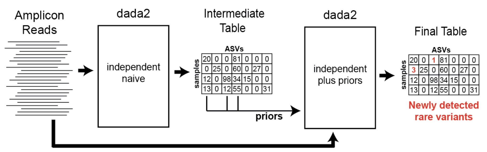

# Modifying Parameters

## DADA2

DADA2 infers amplicon sequences exactly and can be tuned depending on your needs. DADA2 is run in the DADA2 module of the pipeline (`DADA2_ANALYSIS`). Below are parameters that you can set to control your output. 

|Parameter|Description|
|---|---|
|omega_a|This controls the abundance threshold used to determine whether a sequence is overly abundant such that it is likely a true variant and not an error produced by DADA. (default `1e-120`)|
|pool|The method for information sharing across samples (default `pseudo`)|
|band_size|An alignment heursitic that controls whether an alignment will occur between sequences if the number of indels exceed this threshold (default `16`)|
|maxEE|During filtering and trimming, reads that exceed the number of expected errors will be discarded (default `2`)|
|concat_non_overlaps|Setting this to true will concatenate any DADA sequences that were unable to be merged. Reads that are concatenated will have 10 Ns separating the forward and reverse read (ie. `NNNNNNNNNN`) Setting this to false will discard reads that did not have enough bases to merge. The minimum overlap required to merge forward and reverse reads is 12 bases.|

For more information about DADA2 and the parameters that can be set, please refer to their [documentation](https://www.bioconductor.org/packages/release/bioc/manuals/dada2/man/dada2.pdf). 

Below is an example of how you may use the above parameters on the command line:

```bash
nextflow run main.nf --readDIR /wynton/scratch/data --outDIR /wynton/scratch/results -profile sge,apptainer --target v4 -config conf/custom.config --omega_a 1e-120 --band_size 16 --pool pseudo
```

## Further Information

The default parameter setting for pooling in DADA2 is set to False, meaning that all inference is performed on individual samples. Pseudo pooling, on the other hand, involves an initial round of DADA2 clustering followed by pooling the alleles called for each sample, which are then entered as priors for a second round of pooling. This process aims to 'rescue' low abundance alleles that DADA2 identified as errors if they appear at a higher abundance in another sample in the run. However, while this approach may enhance sensitivity in detecting variants, it also carries the risk of reintroducing false positives, potentially due to PCR errors, sequencing errors, and/or low-level contamination.

Through extensive analysis using multiple mixture controls from various runs at different sites, we found that activating pseudo pooling increased the sensitivity of our calls. To address the challenge of additional false positives, we adjusted the omega_a value from the default of 1e-40 to 1e-120.


*pseudo-pooling schematic, Benjamin Callahan, https://benjjneb.github.io/dada2/pseudo.html*

For more detailed information on pseudo pooling, please refer to the documentation available [here](https://benjjneb.github.io/dada2/pseudo.html). If you have any questions or need guidance on selecting the most suitable settings for your specific needs, please feel free to reach out to the UCSF team.


