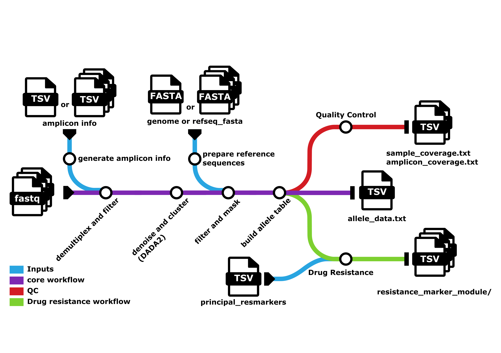

# Pipeline Steps

The diagram below shows the flow of the complete MAD4HATTER pipeline. This page summarizes each of the core steps (purple) and two additional modules: Quality Control (red) and Drug Resistance (green). 

## Core Pipeline Steps 

The MAD4HATTER pipeline processes sequencing data through four main steps. Each step builds on the previous one to transform raw sequencing reads into final results showing which variants (alleles) are present in your samples.

The following sections explain what happens in each step. Click on each section to learn more details.

### Step 1: Demultiplex and Filter

**What it does:** Cleans up your raw sequencing reads by removing unwanted sequences (e.g., primer dimers). Demultiplexes, identifying which reads are associated with which target using the primers. 

**Why it's needed:** Sequencing reads can contain low-quality bases and erroneous reads (e.g., primer dimers). Primer sequences (used to target specific regions) need to be removed and the reads need to be assigned to a target for downstream processing.

**What happens:**
- Removes adapter dimers
- Removes primer sequences
- Trims low-quality bases from the ends of reads
- Filters out reads that are too short after trimming

**Output:** A FASTQ file per target per sample containing cleaned reads. 

### Step 2: Denoise and Cluster

**What it does:** Identifies the actual biological sequences present in your samples by correcting sequencing errors.

**Why it's needed:** Sequencing machines make errors. This step uses DADA2 to distinguish real biological sequences from sequencing errors, giving you accurate counts of each unique sequence.

**What happens:**
- Corrects sequencing errors using a trained error model
- Identifies unique biological sequences (called ASVs - Amplicon Sequence Variants)
- Counts how many times each sequence appears in each sample
- Concatenates reads that don't overlap
- Merge reads that overlap

**Output:** A table showing all unique sequences found and their counts in each sample. This table is output in final results as `raw_dada2_output/dada2.clusters.txt`. For more information on this table see [Raw DADA2 Output](pipeline-outputs.md#raw-dada2-output).

### Step 3: Filter and Mask

**What it does:** Filters sequences based on alignment to the reference. Masks low-complexity regions. 

**Why it's needed:** Issues such as off-target amplification can occur. By aligning to the reference, unexpected sequences can be removed. Sequencing machines can struggle to call bases accurately in low-complexity regions. Masking these regions ensures unreliable regions are not included in final results. 

**What happens:**
- Aligns each unique sequence to the reference for that target
- Filters based on the alignment score (how different from the reference the sequence is)
- Masks low-complexity regions in sequences based on the reference

**Output:** A filtered table of sequences per sample per target. 

### Step 4: Build Allele Table 

**What it does:** Formats final output files, collapsing sequences where masking has made them identical. 

**Why it's needed:** This produces final output tables (allele_data.txt and allele_data_collapsed.txt). 

**Output:** allele_data.txt and allele_data_collapsed.txt. For more information on these outputs see [Allele Data Files](pipeline-outputs.md#allele-data-files).

## Additional Modules 

Quality control and drug resistance modules are also run to provide further interpretation of the data. These are described below.
### Quality Control

**What it does:** Calculates basic statistics to help you understand your data quality.

**Why it's needed:** This step shows you how many reads you have per sample and per amplicon, helping you identify any problems early.

**What happens:**
- Counts reads per sample
- Counts reads per amplicon (target region)
- Calculates coverage statistics

**Output:** Quality control files showing coverage statistics (amplicon_coverage.txt and sample_coverage.txt). For more information on these outputs, see [Coverage Files](pipeline-outputs.md#coverage-files).

### Drug Resistance

**What it does:** This module is designed to identify variants associated with drug resistance in *Plasmodium falciparum* by utilizing the PseudoCIGAR string in `allele_data.txt`. The pipeline identifies markers from `panel_information/principal_resistance_marker_info_table.tsv` (a table of *Plasmodium falciparum* markers of interest) that are covered by the panel. Codons are extracted for each of these markers. Any other mutations observed within these targets are also extracted in a separate output.

**Why it's needed:** This step can allow analysis of specific relevant codons instead of the full microhaplotype sequences stored in allele tables. 

**Output:** folder `resistance_marker_module/`. For full info on the outputs see [Resistance Marker Module Outputs](pipeline-outputs.md#resistance-marker-module-outputs).
