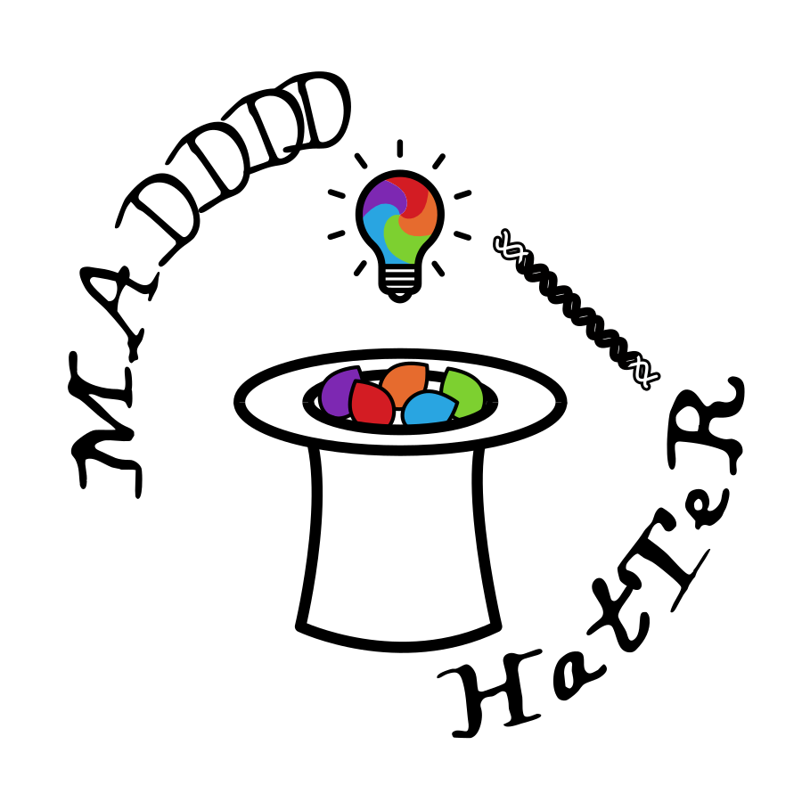

---
# Feel free to add content and custom Front Matter to this file.
# To modify the layout, see https://jekyllrb.com/docs/themes/#overriding-theme-defaults
layout: default
title: Home
permalink: /
nav_order: 1
nav_exclude: true
---

# The MAD4HATTER Amplicon Sequencing 

{: .fs-6 }

Multiplex Amplicons for Drugs, Diagnostics, Diversity, and Differentiation using High Throughput Targeted Resequencing

[Get started now](){: .btn .btn-primary .fs-5 .mb-4 .mb-md-0 .mr-2 }

The MAD4HATTER pipeline will accurately and precisely identify and quantify real biological variation from demultiplexed amplicon sequencing data. The pipeline uses [nextflow](https://www.nextflow.io/) to allow scientists to analyze their sequencing data on a variety of platforms seamlessly. 

To get started, please refer to the [getting started]() page. 

#### Thank you to the contributors of the MAD4HATTER pipeline!

<ul class="list-style-none">

  <li class="d-inline-block mr-1">
     
  </li>

</ul>